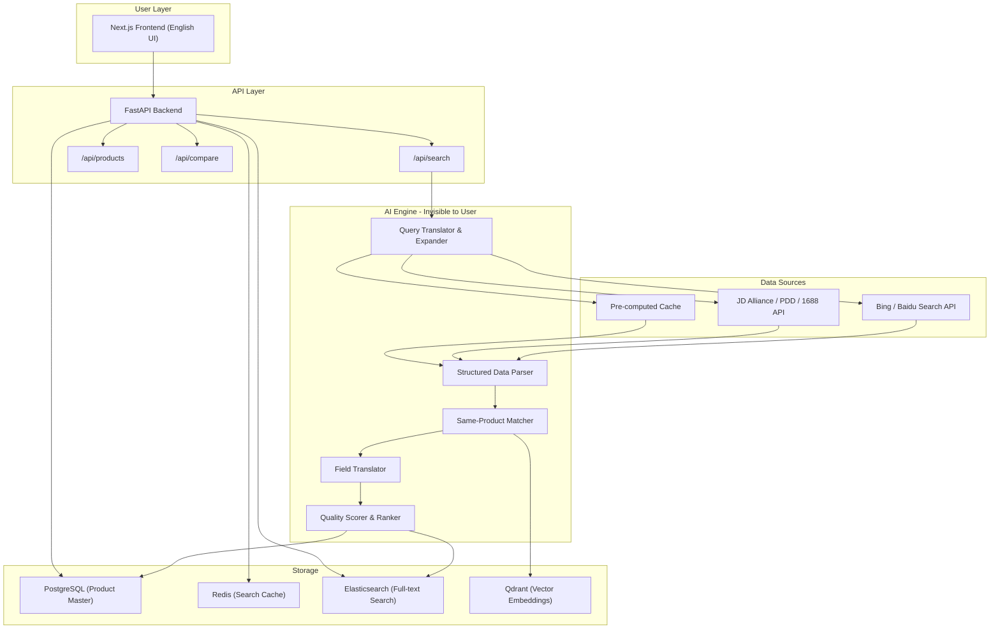
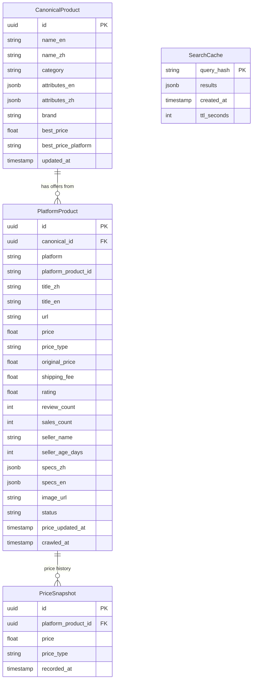
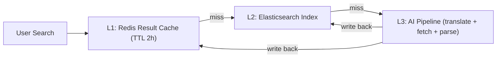

# ChinaPrice -- International Price Comparison Platform

## Architecture Overview



## Tech Stack

- **Frontend**: Next.js 14+ (App Router, SSR for SEO), TailwindCSS, TypeScript
- **Backend API**: Python FastAPI (async, high performance)
- **Database**: PostgreSQL 16 (product master data, price history)
- **Search Engine**: Elasticsearch 8.x (full-text search, multi-field filtering)
- **Cache**: Redis 7 (search result cache, rate limiting)
- **Vector DB**: Qdrant (same-product matching via embeddings) -- Phase 2+
- **Task Queue**: Celery + Redis (async data processing)
- **AI**: OpenAI API (GPT-4o-mini for parsing/translation, text-embedding-3-small for matching)
- **Containerization**: Docker + Docker Compose (local dev and deployment)
- **Cloud**: Aliyun ECS (production deployment, Phase 3+)

## Data Model (Core)



## Phase 1: Project Scaffolding and Local Dev Environment (Week 1)

**Goal**: Set up monorepo, Docker environment, database schema, and basic API skeleton that all subsequent phases build on.

### 1.1 Monorepo Structure

```
chinaprice/
  frontend/              # Next.js app
    src/
      app/               # App Router pages
      components/        # React components
      lib/               # Utilities, API client
      types/             # TypeScript type definitions
  backend/
    app/
      api/               # FastAPI route handlers
      core/              # Config, database, dependencies
      models/            # SQLAlchemy ORM models
      schemas/           # Pydantic request/response schemas
      services/          # Business logic layer
        ai/              # AI engine modules
        data_sources/    # Platform API integrations
        matching/        # Same-product matching
        translation/     # i18n translation pipeline
      tasks/             # Celery async tasks
    alembic/             # Database migrations
    tests/
  docker-compose.yml     # PostgreSQL, Redis, ES, backend, frontend
  .env.example
  README.md
```

### 1.2 Docker Compose Services

- `postgres`: PostgreSQL 16, port 5432
- `redis`: Redis 7, port 6379
- `elasticsearch`: Elasticsearch 8.x, port 9200
- `backend`: FastAPI app, port 8000
- `frontend`: Next.js dev server, port 3000
- `celery-worker`: Celery worker for async tasks
- `celery-beat`: Celery periodic task scheduler

### 1.3 Database Schema Migration

- Create all core tables via Alembic: `canonical_product`, `platform_product`, `price_snapshot`, `search_cache`
- Add indexes: platform + platform_product_id unique, canonical_id, category, price range, updated_at

### 1.4 API Skeleton

Endpoints (all return JSON):
- `GET /api/search?q=...&category=...&sort=...&page=...` -- main search
- `GET /api/products/{id}` -- single canonical product with all platform offers
- `GET /api/compare?ids=id1,id2,id3` -- side-by-side comparison
- `GET /api/categories` -- category tree
- `GET /api/health` -- health check

---

## Phase 2: Data Acquisition Layer (Week 2-3)

**Goal**: Build the multi-source data pipeline that feeds the platform.

### 2.1 Search API Integration (Primary Data Source for Demo)

**File**: `backend/app/services/data_sources/search_api.py`

- Integrate Bing Web Search API (free tier: 1000 calls/month, paid: $3/1000)
- For each user query, generate search queries:
  - `"{product_name_zh} site:taobao.com price"`
  - `"{product_name_zh} site:jd.com price"`
  - `"{product_name_zh} site:1688.com price"`
  - `"{product_name_zh} site:pinduoduo.com price"`
- Parse search result snippets to extract: title, price, URL, platform

### 2.2 Platform API Integration (Stable Data Source)

**Files**: `backend/app/services/data_sources/{jd,pdd,taobao,ali1688}.py`

- JD Alliance API: product search, price query, commission info
- PDD (Duo Duo Jin Bao) API: product search, coupon info
- Taobao Open Platform API: product search (requires app approval)
- 1688 Open Platform API: product search, batch pricing

Each adapter implements a common interface:

```python
class DataSourceBase(ABC):
    async def search(self, query_zh: str, page: int, page_size: int) -> list[RawProduct]
    async def get_product(self, product_id: str) -> RawProduct | None
    async def check_health(self) -> bool
```

**For the Demo**: Start with Bing Search API + 1 platform API (JD Alliance is easiest to get approved). Other platforms can return mock data initially.

### 2.3 AI Query Translation and Expansion

**File**: `backend/app/services/ai/query_translator.py`

- Input: English keyword (e.g., "wireless earbuds noise cancelling")
- Output: 4-8 Chinese search query variants
- Model: GPT-4o-mini (cheapest, fast enough)
- **Cost control**: Cache translations in Redis with 7-day TTL. Same English query never calls AI twice.

### 2.4 AI Data Parser

**File**: `backend/app/services/ai/data_parser.py`

- Parse unstructured search snippets into structured fields
- Extract: product name, price, price type, specs, seller info
- **Cost control**: Use rule-based parsing first (regex for prices, URL patterns for platform detection). Only call LLM for ambiguous cases.
- Batch processing: group 10-20 snippets per LLM call to reduce API overhead

### 2.5 Data Orchestrator

**File**: `backend/app/services/data_orchestrator.py`

- Coordinates the full pipeline: translate query -> fan out to data sources -> parse -> deduplicate -> store
- Implements timeout and fallback: if a data source is slow (>5s), proceed with available results
- Returns partial results fast, backfills remaining asynchronously

---

## Phase 3: AI Processing Pipeline (Week 3-4)

**Goal**: Transform raw data into comparable, English-ready product cards.

### 3.1 Same-Product Matching Engine

**File**: `backend/app/services/matching/product_matcher.py`

Three-layer strategy:

- **Layer 1 -- Rule-based** (free, fast): brand + model number + key spec exact match
- **Layer 2 -- Text similarity** (cheap): TF-IDF or Jaccard on normalized titles, threshold > 0.75
- **Layer 3 -- Semantic embedding** (Phase 2+): text-embedding-3-small vectors in Qdrant, cosine similarity > 0.85

For the Demo, Layer 1 + Layer 2 is sufficient. Layer 3 adds accuracy for products without model numbers (fashion, home goods).

### 3.2 Price Standardization

**File**: `backend/app/services/ai/price_normalizer.py`

- Detect price type: original / coupon / group-buy / member / flash-sale
- Convert all prices to CNY base price
- Calculate estimated international price: CNY price + estimated shipping + estimated service fee
- Store price history snapshots for trend data

### 3.3 Field Translation Pipeline

**File**: `backend/app/services/translation/translator.py`

Three-tier cost optimization:

- **Tier 1 -- Dictionary lookup** (free): Maintain a mapping dictionary for common terms (colors, materials, sizes, units). E.g., "雾霾蓝" -> "Haze Blue", "斤" -> "500g"
- **Tier 2 -- Template translation** (free): Category-specific templates. E.g., earbuds always have: driver size, impedance, battery life. Translate the template once, fill in values.
- **Tier 3 -- LLM translation** (paid): Only for product titles and unusual description text. Use GPT-4o-mini with batch API for cost savings.

**Spec mapping dictionary file**: `backend/app/services/translation/dictionaries/`
- `colors.json`: Chinese color names to English
- `materials.json`: Material names
- `sizes.json`: Chinese sizes to international sizes (S/M/L, US, EU)
- `units.json`: Chinese units to metric/imperial
- `categories.json`: Category taxonomy

### 3.4 Quality Scoring and Ranking

**File**: `backend/app/services/ai/scorer.py`

Composite score (0-100) based on:
- Price competitiveness (30%): percentile rank within same-product group
- Seller trust (25%): store age, rating, return rate
- Review quality (20%): review count + average rating
- Data freshness (15%): how recently was this price verified
- Link health (10%): is the link still active

Sort options for user: Best Value / Lowest Price / Best Rated / Most Popular

---

## Phase 4: Frontend -- English UI (Week 4-6)

**Goal**: Build a clean, fast, English-first comparison interface.

### 4.1 Pages

- **Home page** (`/`): Search bar, trending categories, popular comparisons
- **Search results** (`/search?q=...`): Grid/list view of product cards, filters sidebar, sort controls
- **Product detail** (`/product/[id]`): All platform offers for one product, price comparison table, price history chart, specs table
- **Compare page** (`/compare?ids=...`): Side-by-side comparison of 2-5 products, diff highlighting on specs
- **Category browse** (`/category/[slug]`): Browse by category

### 4.2 Key Components

- `SearchBar`: English input, auto-suggest, recent searches
- `ProductCard`: Image, English title, best price, platform badges, trust score
- `PlatformOfferRow`: Single platform offer with price, seller info, "View on {platform}" button
- `ComparisonTable`: Dynamic column comparison with spec diff highlighting
- `PriceHistoryChart`: Line chart showing price trend over time (recharts)
- `FilterSidebar`: Price range slider, platform checkboxes, rating filter, sort dropdown
- `PriceFreshnessTag`: "Updated 2h ago" / "Updated today" / "May be outdated" tag

### 4.3 UX Considerations

- Every price displays the price type: "Coupon price", "Group-buy price", "Original price"
- Every product link has a clear "Visit on Taobao" / "Visit on JD" button with platform logo
- Products that cannot be purchased directly by international users show a notice: "This product is on a China-only platform. International purchasing agent may be needed."
- All prices show both CNY and USD (or user's local currency)
- Mobile responsive from day 1 (50%+ of target users are on mobile)

### 4.4 SEO Strategy (built into Next.js SSR)

- Dynamic meta tags per product and category page
- Structured data (JSON-LD) for product listings
- Sitemap generation for indexed product pages
- URL structure: `/search/wireless-earbuds`, `/product/xxx-bluetooth-headphone`

---

## Phase 5: Cost Control and Caching Architecture (Throughout)

**This is not a phase -- it is a design principle applied from Day 1.**

### 5.1 Multi-Layer Cache Strategy



- **L1 Redis**: Exact query match. TTL 2 hours for hot queries, 24 hours for cold queries.
- **L2 Elasticsearch**: Fuzzy search on pre-processed products. Covers 90%+ of queries after warm-up.
- **L3 AI Pipeline**: Only triggered for genuinely new queries. Results write back to L1 and L2.

### 5.2 AI Cost Budget

| Item | Model | Per-call cost | Daily cap | Monthly budget |
|---|---|---|---|---|
| Query translation | GPT-4o-mini | ~$0.0003 | 500 unique queries | ~$5 |
| Data parsing | GPT-4o-mini (batch) | ~$0.001/10 items | 200 batches | ~$6 |
| Field translation | GPT-4o-mini (batch) | ~$0.001/10 items | 100 batches | ~$3 |
| Embedding | text-embedding-3-small | ~$0.00002/item | 5000 items | ~$3 |
| **Total** | | | | **~$17/month** |

With aggressive caching, real-world costs should be well under $50/month for Demo stage.

### 5.3 Pre-computation Strategy

- **Celery Beat** runs nightly batch jobs for top categories:
  - Refresh prices for top 10,000 products
  - Re-translate any updated product titles
  - Re-index Elasticsearch
  - Clean expired cache entries
- **Hot product list**: Track search frequency, pre-compute results for top 100 search terms

---

## Phase 6: Trust and Data Quality (Week 5-6)

### 6.1 Link Health Monitoring

- Celery periodic task: check all stored product URLs every 24h
- Mark dead links as `status: inactive`, hide from search results
- Alert if >10% of links for a platform go dead (possible API/page change)

### 6.2 Price Accuracy Indicators

- Display `price_updated_at` on every price
- Color-code freshness: green (<2h), yellow (2-24h), red (>24h)
- Add disclaimer: "Prices shown are approximate. Actual price may differ on the merchant's site."

### 6.3 User Feedback Loop (lightweight)

- "Report wrong price" button on each product
- "Wrong product match" flag on comparison page
- Store feedback in DB for manual review and model improvement

---

## Phase 7: Deployment and Launch (Week 6-7)

### 7.1 Demo Deployment (Minimal Cost)

For initial demo, deploy to a single Aliyun ECS instance:

- **ECS**: 4-core 8GB, ~600 RMB/month
- **RDS PostgreSQL**: 2-core 4GB, ~400 RMB/month (or self-host in Docker to save money for demo)
- **Domain**: Purchase + ICP filing (if hosting in mainland China) or use HK/international server to skip filing

**Alternative for Demo**: Deploy to a single VPS (4-core 8GB) with Docker Compose running everything. Total cost: ~400-800 RMB/month.

### 7.2 Monitoring

- Application: basic logging + Sentry for error tracking (free tier)
- Uptime: UptimeRobot (free tier)
- API cost: Daily script that checks OpenAI usage dashboard

### 7.3 Demo Scope Constraints

To ship fast, the Demo explicitly does NOT include:
- Purchase/agent integration (planned for future)
- User accounts / login
- Price drop alerts
- Browser extension
- Mobile app (responsive web only)
- More than 2-3 product categories
- Real-time price queries (pre-computed + 2h cache only)

---

## Phase 8: Post-Demo Expansion Roadmap (Future)

After Demo validation, expand in this order:

1. **More platforms**: Add remaining platform APIs as they get approved
2. **More categories**: Expand from 2-3 to 10+ categories
3. **Vector matching**: Add Qdrant for semantic same-product matching
4. **Purchase integration**: Partner with Superbuy/Pandabuy for "Buy Now" flow
5. **User accounts**: Favorites, price alerts, search history
6. **Browser extension**: "Find cheaper on Chinese platforms" overlay on AliExpress/Amazon
7. **B2B features**: Bulk pricing calculator, MOQ filters, supplier comparison
8. **Mobile app**: React Native or Flutter

---

## Risk Mitigation Summary

| Risk | Mitigation |
|---|---|
| Platform API approval delayed | Start with Bing Search API; mock remaining platforms |
| AI costs spike | 3-tier caching, batch processing, daily cost caps |
| Price inaccuracy damages trust | Freshness tags, disclaimers, user report button |
| Single AI provider dependency | Abstract AI layer to swap OpenAI / Claude / Qwen |
| Anti-scraping blocks search API results | Multiple search providers, graceful degradation |
| Legal/compliance issues | Only display publicly indexed data, follow affiliate ToS |
| No users find the platform | Build SEO pages from Day 1, prepare Reddit/YouTube content |

---

## Key Files to Create First

1. `docker-compose.yml` -- All infrastructure services
2. `backend/app/core/config.py` -- Environment config, API keys
3. `backend/app/models/product.py` -- SQLAlchemy models
4. `backend/app/services/data_sources/bing_search.py` -- Primary data source
5. `backend/app/services/ai/query_translator.py` -- English-to-Chinese query AI
6. `backend/app/services/ai/data_parser.py` -- Snippet-to-structured-data AI
7. `backend/app/services/translation/translator.py` -- Chinese-to-English pipeline
8. `backend/app/api/search.py` -- Main search endpoint
9. `frontend/src/app/page.tsx` -- Home page with search
10. `frontend/src/app/search/page.tsx` -- Search results page
